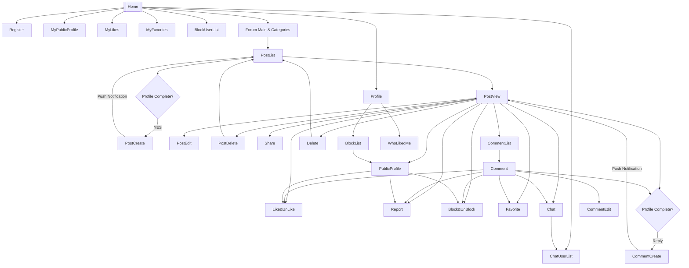
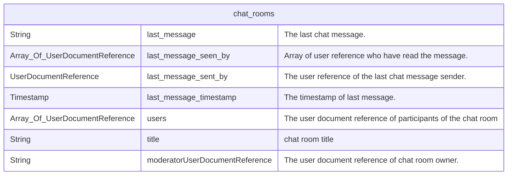
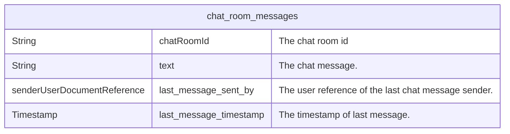

# Fireflow

- This project is for supporting FlutterFlow apps.

* 플러터플로를 통해 앱 개발을 할 때 백엔드의 역할이 필요하다.
  * 예를 들면, 코멘트 작성할 때,
    * 글 작성자가 총 몇개의 코멘트를 작성했는지, 글 작성자 문서의 noOfComments 를 업데이트하고,
    * 글의 noOfComments 를 업데이트하고,
    * 카테고리의 noOfComments 를 업데이트하고,
    * 전체 코멘트 수를 기록하는 noOfComments 를 업데이트하고,
    * 코멘트를 트리 구조형으로 목록하고 들여쓰기를 위해서 depth 와 sort 를 업데이트하고,
    * 푸시 알림을 하고 (내글 반응, 게시판 구독 처리)
    * 코멘트를 작성하면 포인트를 부여하고 -> 회원 레벨 조정하고
    * 등 등 많은 추가적인 작업이 필요한데, 이러한 모든 추가 작업을 백엔드에서 처리하는 것이다.

* 플러터플로의 치명적인 단점은 debug run 과 instant reload 가 매우 느리다는 것이다. 앱 내의 페이지(스크린) 수가 100개가 넘고, 각종 위젯을 추가하면, debug run 이 4분 이상 걸리고, instant reload 가 1분 30초 이상 걸린다. 그래서 개발이 원활하지 않게 되는데, 가능한 많은 작업을 백엔드에서 해서, 프론트엔드의 복잡도를 낮추고 이로 인해 개발 시간을 단축시킬 수 있도록 한다.

- [Fireflow](#fireflow)
- [TODO](#todo)
- [개요](#개요)
- [기능](#기능)
- [커뮤니티 기능 플로우챠트](#커뮤니티-기능-플로우챠트)
- [Firestore DB 구조](#firestore-db-구조)
  - [Firestore Indexes](#firestore-indexes)
- [시스템 설정](#시스템-설정)
  - [How to set a user as admin](#how-to-set-a-user-as-admin)
  - [헬퍼 사용자 지정](#헬퍼-사용자-지정)
- [사용자](#사용자)
- [Chat](#chat)
  - [Database structure of Chat](#database-structure-of-chat)
    - [Chat rooms](#chat-rooms)
    - [Chat room messages](#chat-room-messages)
  - [Chat logics](#chat-logics)
  - [When a user creates a chat room](#when-a-user-creates-a-chat-room)
    - [For 1:1 chat](#for-11-chat)
    - [For group chat](#for-group-chat)
    - [Inviting users](#inviting-users)
  - [When a user enters a chat room](#when-a-user-enters-a-chat-room)
  - [How to list my chat rooms.](#how-to-list-my-chat-rooms)
  - [How to count No of new message.](#how-to-count-no-of-new-message)
  - [How to set new message.](#how-to-set-new-message)
  - [Change title](#change-title)
- [가입 환영 인사](#가입-환영-인사)
- [게시판](#게시판)
  - [카테고리](#카테고리)
  - [글](#글)
  - [코멘트](#코멘트)
    - [글 삭제](#글-삭제)
- [채팅](#채팅)
- [보안](#보안)
- [Test codes](#test-codes)
  - [lab folder](#lab-folder)
# TODO

* Firestore 보안 규칙 확인

* 코멘트를 작성 할 때, post document 또는 parent document 둘 중 하나만 입력해서 저장하면,
  * 필요한 모든 처리를 백엔드에서 한다.
  * 예) post 에 noOfComments 업데이트, comment 에 depth, list-order 업데이트, 사용자 프로필에 noOfComments 업데이트 등

# 개요

* 플러터플로에서 하기 어려운 기능(또는 쉽지 않은 기능)인데 백엔드에서는 간단히 할 수 있는 것이 있다. 또 그 반대로 플러터플로에서 쉽게 할 수 있는 기능인데, 백엔드에서는 어려운 기능이 있다. 이러한 기능의 조율을 적절히 하여 

* 백엔드 관련된 내용 참고
  * Cloud function 의 Firestore background functions 에서는 `context.auth` 를 사용 할 수 없다. 그래서 항상 userDocumentReference 에서 글 쓴이 문서 ref 를 전달해 주어야 한다.
  * 또한 백엔드에서 업데이트하는 데이터(필드)는 한박자 늦을 수 있다. 그래서 `createdAt` 과 같이, 목록에서 정렬할 때 사용되는 변수는 처음 저장 할 때, 같이 저장 해 주어야 한다. (그렇지 않으면 목록에 바로 나오지 않을 수 있다.)

# 기능

- 회원 가입시 `users_public_data` 생성 및 회원 업데이트 할 때 마다 동기화. 이 문서에는 개인 정보를 뺀 나머지 정보만 저장되므로, 외부 공개용으로 사용.
- 회원 가입시, 환영 인사 채팅 메시지 전송.

# 커뮤니티 기능 플로우챠트

# Firestore DB 구조

- `/settings` 에 앱/시스템 자체의 설정이다. 참고, 관리자 지정, 헬퍼 지정
- `/user_settings` 에 각 사용자별 설정을 저장한다.

## Firestore Indexes

- We don't use any of the security rules from FF. Instead, we defined our own Firestore security rules.

# 시스템 설정

- `/settings/system` 에는 시스템 설정을 지정한다. 주로 앱 버전, 헬퍼 사용자 지정 등을 할 수 있다.
- `/settings/counters` 에는 각 종 카운터가 기록된다.
  - `noOfUsers` - 총 회원 수
  - `noOfPosts` - 총 글 수 (todo)
  - `noOfComments` - 총 코멘트 수 (todo)

## How to set a user as admin

- Add the user's UID as a field as in `/settings/admins { uid: boolean }`.
  - You may add multiple users as admin.
  - ex) `/settings/admins { 9Sefounafeou384: true }`

- Then, set the `admin` field to true in user's document.
  - ex) `/users/9Sefounafeou384 {admin: true}`

## 헬퍼 사용자 지정

- 헬퍼 사용자는 사용자와 상담을 하는 담당자(직원) 계정을 말한다. 예를 들면, 회원 가입을 하면, 자동으로 가입 환영 인사 메시지를 하나 보내는데, 이 때, 헬퍼 사용자 계정이 메시지를 보내는 것이다.

- 헬퍼 사용자 지정하는 방법
    - `/settings/system/ {helperUid: UID }` 를 지정하면, 그 사용자는 헬퍼 사용자가 된다.

# 사용자

- `/users` 컬렉션은 기본 사용자 문서 컬렉션인데 변경이 가능하다. 사용자 문서 컬렉션은 (변경을 해도) 이메일과 전화번호가 저장되며, 플러터플로의 기본 채팅 기능을 사용하기 위해서는 반드시 외부에 (모든 사람이 볼 수 있도록) 공개되어야 한다. 즉, 개인 정보가 노출된다.
  - 그래서, Fireflow 에서는 `/users` 를 본인만 읽을 수 있도록 하고, 대신 공개 정보는 `/users_public_data` 에 저장해서 사용한다.

- 사용자가 가입하거나 회원 정보를 수정하면, `/users/<uid>` 문서가 `/users_public_data` 로 sync 된다.
  - 이 때, 개인 정보인 `email` 과 `phone_number` 를 빼고 sync 하며, 추가적으로 `blockedUserList` 도 sync 되지 않는다.
  - 그리고 다음과 같은 추가 정보가 기록된다.
    - `isProfileComplete: boolean` - 회원 정보 중에서 `display_name`, `email`, `photo_url` 이 있으면 true 아니면 false 로 저장된다. 회원 정보 목록에서 프로필을 모두 적용한 회원 정보 목록을 할 때 사용 할 수 있다.
    - `hasPhoto` - 회원 정보에서 `photo_url` 이 있으면 true 아니면 false. 회원 정보 목록에서 사진이 있는 회원 정보 목록을 할 때 사용 할 수 있다.
    - `userDocumentReferenc` - 회원 ref
    - `updatedAt` - 회원 정보 수정한 시간

- `/users_public_data` 는 영구적으로 사용 가능하다. 공개할 정보가 있으면 이곳에 기록을 하면 되는데, 아래와 같은 추가 필드가 사용된다.
  - `likes` - 나를 좋아한 사용자 ref 배열

- `command` field
  - The app can run a command on backend by setting the command on `/users/{uid} { command: ... }` field.
  - For instance, if a user set `delete` on his `command` field, then the user account will be deleted. This `delete` command is being used for acccount deletion (resinanation).

# Chat

- The default chat functionality in FlutterFlow is no good.
  - No custom design support.
  - No extra action on touching messages.
  - And the biggest problem is user's private information is revealed to the world. There are no other way but to open user's document to the world. This is the reason why we need to build our own chat functionality.

## Database structure of Chat

### Chat rooms

* The `Document ID` is the chat room id. and it can be in two forms.
  * For 1:1 chat, it is in the form of `UID-UID`. There are two users only on 1:1 chat. So, we put the two uids in the document id. The chat room id is ordered as ascending.
    * For entering 1:1 chat room, the app only needs to know `who` the user wants to chat. And this makes easy to enter a chat room entering from post view screen, or profile screen. You just need to get the other user's uid.
    * In the chat room, the other chat user's photo and name should be displayed as appbar title.
  * For group chat, the `chat room id` is created as random document id.
    * To enter a group chat room, you need to know the `chat room id`.
    * In chat room, the title and no of users should appear as title of appbar.

### Chat room messages

## Chat logics

## When a user creates a chat room

### For 1:1 chat

* The app must pass the document of `users_public_data` to chat room.
* The chat room will be created by `ChatRoomMessages` custom widget in FF.
  * `A` opens a chat room with `B` in FF, `ChatRoomMessages` will create the chat room if it does not exist.

### For group chat

* User creates a group chat by entering `title`.

### Inviting users

* For group chat, a user can invite another user.

## When a user enters a chat room

## How to list my chat rooms.

- Do backend query on chat_rooms where my user document reference is in `users` field. That's my rooms.

## How to count No of new message.

- Get all the document of my chat rooms, and count rooms where my user document reference is not in `last_message_seen_by`.

## How to set new message.

- When the user A in the chat sends a message, set the user document reference of A in  `last_message_seen_by`. Note that, this is done by backend. So, the app does not need to do anything about it.

## Change title

- For group chat, the owner of the chat can change the title.

- TODO: 현재는 1:1 채팅방만 지원한다. 채팅방 아이디가 `UID-UID` 로 정해지는데, 그룹 채팅인 경우는 채팅방 아이디를 그냥 자동생성한 문서 아이디로 하고, `/chat_rooms` 의 `users` 필드에 두 명이 아닌 여러명의 사용자를 기록해서 그룹 채팅을 할 수 있도록 한다. 이 때, `new_messages` 맵에 `{uid: [count]}` 와 같이 해서, 각 사용자당 읽지 않은 메시지 수를 기록 하도록 한다. 즉, 그룹 채팅에 메시지를 보내기 위해서는 채팅방 아이디를 알아야한다. 참고로 1:1 채팅에서는 채팅방 아이디가 `UID-UID`이므로, 채팅방이 아닌 외부에서도 메시지를 보낼 수 있다. 가능한 동일한 구조를 유지하며, 1:1 채팅방과 호환이 되도록 작성한다.

- 플러터플로의 채팅 기능에는 아래와 같은 문제가 있다.
  - 개인 정보 노출. `/users` 문서에는 이메일, 전화번호 등이 들어가는데, 반드시 외부에 공개되어야지만, 채팅 기능이 동작한다.
  - 커스텀 디자인이 안된다. 플러터플로에서 제공하는 채팅 기능은 UI/UX 가 고정해져 있다. 기본 기능이 매우 빈약하며 변경 할 수 없다.

  이러한 제약 사항을 해결하고자 새로운 채팅 기능을 제작했다.

- `/chat_rooms` 에 채팅방 정보가 저장된다.
- `/chat_room_messages` 에 각 채팅 문서가 저장된다.

- 채팅 메시지를 보낼 때, 채팅방 정보가 존재하지 않으면 생성을 한다. 따라서 채팅 문서를 `/chat_room_messages` 에 생성하면, 자동으로 채팅방 정보가 업데이트 된다.
  - 이것은, 채팅방 외부에서 채팅 메시지를 보내고자 할 때에도 쉽게, 보내고자 하는 사람의 user ref 만 알면 메시지를 보낼 수 있다.
    - 예를 들어, 맨 처음 로그인을 하면, 사용자에게 웰컴 메세지를 보내거나,
    - 게시판/코멘트에서 채팅방으로 들어가지 않고, 바로 사용자에게 쪽지를 보내거나 등의 작업을 할 수 있다.

# 가입 환영 인사

- `/settings/system { helperUid: ..., welcomeMessage: ... }` 두 개의 필드가 존재하면, 새로 가입하는 사용자에게 환영 인사를 채팅으로 보낸다. 따라서 회원 가입하자 마자 (처음 사용하는 사용자에게) 새로운 채팅 메시지가 한 개 도착해 있게 된다.

# 게시판

- 글을 작성하면 사용자 문서의 `noOfPosts` 에 1 증가하고, (해당 글) 카테고리의 `noOfPosts` 에 1 증가하고, `/settings/counter {noOfPosts: ... }` 에 1 증가한다.
- 코멘트를 작성하면 사용자 문서의 `noOfComments` 에 1 증가하고, (해당 코멘트) 카테고리의 `noOfComments` 에 1 증가하고, `/settings/counter {noOfComments: ... }` 에 1 증가한다.
  - 또한, 그 코멘트의 글(최 상위 글)의 `noOfComments` 에 1 증가한다.

## 카테고리

- 게시판에 글을 쓸 때에는 반드시 카테고리가 존재해야지만 글을 쓸 수 가 있다.
- 글(`noOfPosts`) 또는 코멘트(`noOfComments`)가 작성 될 때 마다 카운터가 1씩 증가한다.

## 글

- 글 작성할 때 아래의 정보들이 자동으로 업데이트된다.
  - 글 작성자(`/users`, `/users_public_data`)의 `noOfComments`
  - 카테고리의 `noOfComments`
  - 전체 글 수 `/settings/counters/ {noOfPosts: ...}`
  - 기타 소스 코드를 확인해서, 어떤 내용들이 업데이트되는지 확인한다.

- 글 삭제 할 때,
  - 보안 규칙에서 글 삭제하지 못하도록 하고 있다.
  - 그래서, 글 문서에 `deleted` 필드에 true 로 저장하면, 나머지는 백엔드에서 조치를 한다.
  - 백엔드에서는
    - `noOfComments` 가 0 인 경우에는 글 문서를 삭제한다.
    - `noOfComments` 가 0 이 아닌 경우에는 글 제목, 내용, 첨부 파일 등을 삭제하고, 글 문서 자체는 남겨 놓는다.

- `hasComments` - 게시글에 코멘트가 달리면, 이 필드가 true 가 된다. 코멘트가 없으면 이 필드는 존재하지 않는다.

- 게시판의 활용도는 메우 높다.
  - 쇼핑몰, 중고 장터, 구인 구직 등의 여러가지 기능들이 게시판 기능 위에서 구현될 수 있다. 예를 들면, 쇼핑몰을 게시판 카테고리로 만들고, 쇼핑몰 아이템을 게시글에 등록하여 관리 할 수 있다. 그리고 각 아이템의 리뷰는 코멘트로 관리 할 수 있다.
  - 게시판의 글 컬렉션인 `posts` 문서에 각종 필드를 추가하여 여러가지 용도로 활용 할 수 있는데, 그 중 몇 몇 필드를 미리 정해 놓고, 다른 용도로 활용 할 때, 쓰면 좋은 것들이 있다.
    - `subtitle` - 부제목. 꼭 부제목 뿐만아니라 여러가지 용도로 활용가능하다.
    - `info` - 각종 정보를 기록하는 필드.
    - `date` - 어떤 날짜. 행사가 있거나 특정일 정해야 하는 경우.
    - `dateBegin` - 시작 날짜
    - `dateEnd` - 끝 날짜
    - `hasPhoto` - 사진이 업로드되었는지 확인. 게시글에 사진이 업로드되었으면, `true` 를 저장하고, 아니면 `false` 를 지정한다. 이렇게 하면, 사진이 있는 글만 쉽게 골라 낼 수 있다. 참고로 문서 업데이트를 하는 경우에는 백엔드에서 처리를 하기 쉽지 않은 면이 있다. 그래서 이 필드는 백엔드에서 자동 설정을 하지 않고, 클라이언트에서 해 주어야 한다.

## 코멘트

- 코멘트를 작성 할 때에는 `userDocumentReference`, `postDocumentReference`, `parentCommentDocumentReference` 와 같이 세 개의 레퍼런스가 들어가야 한다.
  - 특히, `parentCommentDocumentReference` 는 상위 코멘트 정보를 추적 할 때 사용된다. (푸시 알림 등에서 사용)
  - 코멘트를 작성하면, 자동으로 `depth` 와 `order` 가 추가 된다.
    - 하지만, 백엔드의 동작은 약간 느리다. 그래서 가능하면 그냥 플러터플로에서 곧 바로 추가하기를 권한다.
  - `category` 가 자동 추가된다. 글 카테고리와 마찬가지로 코멘트에도 카테고리가 필요한 경우가 있다. 이와 같은 경우, 해당 카테고리에 어떤 코멘트가 있는지 표시하기 위해서 클라이언트에서 직접 저장을 하면 된다. 주의 할 것은, 코멘트 생성시 (한번만) 추가된다. 수정을 할 때 임의로 다른 값을 저장 해도 된다.
  - 코멘의 글(부모 글)을 업데이트하는데 `noOfComments` 에 코멘트 개 수, `hasComments` 에 true 가 저장된다.

- 코멘트의 정렬에 사용되는 `order` 는 글의 `noOfComments` 와 연관되어 동작한다. 그래서, 코멘트를 삭제 할 때, `noOfComments` 의 값을 -1 하면 안된다. 이 문제를 해결 하기 위해서는 `order` 필드를 `noOfComments` 가 아닌, 다른 필드에 총 기록된 코멘트 수를 따로 보관해야 한다.

- 코멘트의 활용을 위해서 아래의 필드를 추가 할 수 있다. 물론 추가 안해도 된다.
  - `title` - 코멘트 제목. 코멘트에도 필요한 경우 제목을 추가해도 된다.
  - `hasPhoto` - 사진이 업로드되었는지 확인. 게시글에 사진이 업로드되었으면, `true` 를 저장하고, 아니면 `false` 를 지정한다. 이렇게 하면, 사진이 있는 코멘트만 쉽게 골라 낼 수 있다.

### 글 삭제

- 코멘트를 삭제 할 때에는 실제 문서를 삭제하면 안되고, `deleted: true` 필드를 저장하면 된다. 즉, 삭제되었다는 표시만 해 놓는 것으로, 앱 화면에 보여 줄 때에도 `삭제되었습니다.` 라고 저장 해 놓으면 된다.

# 채팅

- 플러터플로에서 제공하는 기본 채팅 기능이 좋지 않아서, 새로 제작을 해서 사용한다.
- 새로운 메시지가 작성되면 상대방에게 푸시 알림을 보낸다.

# 보안

- 완벽한 보안을 작성해야 한다.

# Test codes

## lab folder

- The code under lab folder is a labratory code and you should not use.

